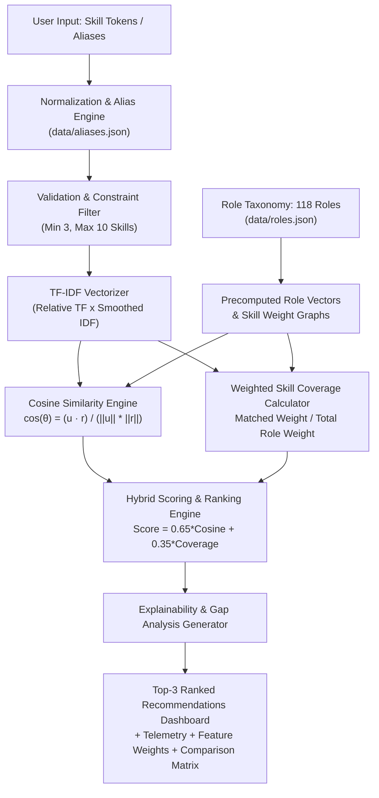
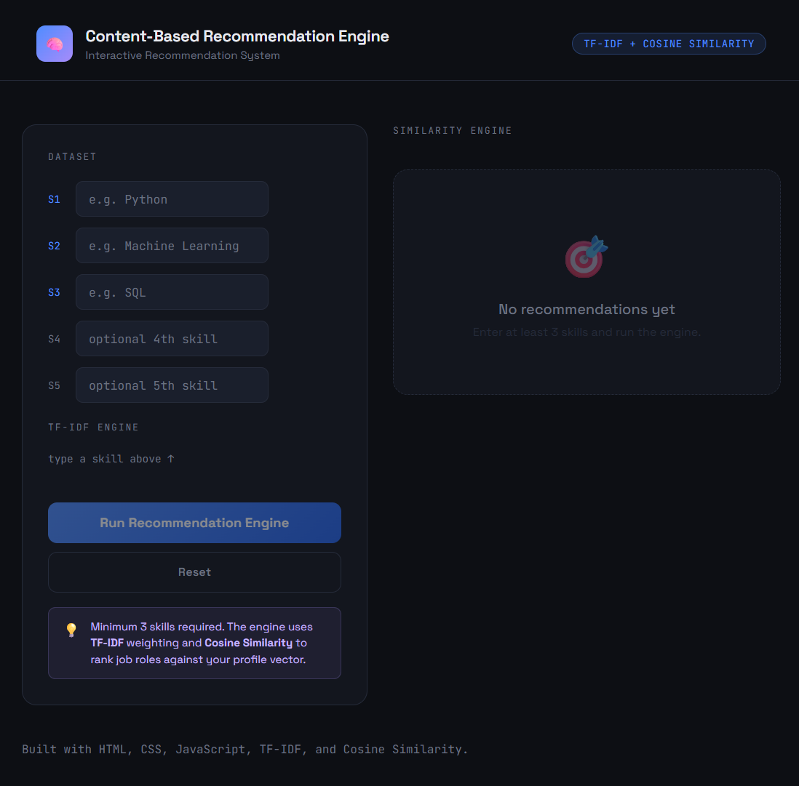
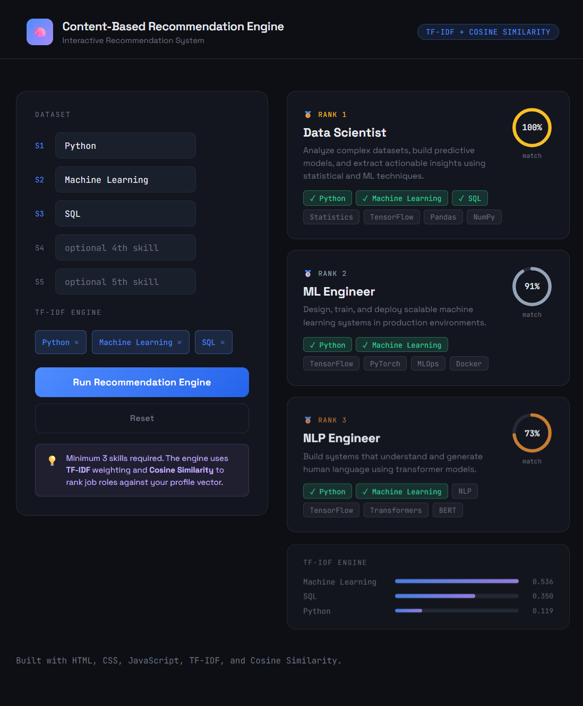

# CareerMatch

> **Explainable Content-Based Career Recommendation Engine**

CareerMatch is an Information Retrieval & Machine Learning recommendation system that matches technical skill sets to specialized technology career pathways. Powered by **TF-IDF Vectorization**, **Smoothed Inverse Document Frequency (IDF)**, **Cosine Similarity**, **Weighted Skill Relevance**, and an interactive **Explainability Engine** — implemented in **pure Vanilla JavaScript** with zero external runtime dependencies.

---

## Live Demo

- **Deployment URL**: *[https://careermatch-engine.vercel.app](https://careermatch-engine.vercel.app)* *(or deploy via GitHub Pages / Vercel)*
- **Offline Benchmark Suite**: `python evaluation/evaluate.py`

---

## Overview

In modern technology recruitment and career development, candidates frequently struggle to understand which career pathways best align with their technical skill sets and what specific skills they need to acquire to bridge the gap.

**CareerMatch** solves this by treating career pathways as structured document profiles within a high-dimensional vector space. Given a user's technical skills (including aliases, acronyms, and synonyms), the engine:
1. Normalizes and validates the inputs.
2. Projects the user profile into a TF-IDF vector space calibrated against a corpus of 118 career roles.
3. Computes vector-space cosine proximity and weighted skill coverage.
4. Ranks candidate roles through a multi-tier deterministic scoring function.
5. Emits explainability summaries, matching breakdowns, and prioritized missing skills to learn.

---

## Problem Statement

Traditional keyword-based job search engines suffer from significant limitations:
- **No Term Discrimination**: Frequent general skills (e.g., *Python*, *SQL*, *Git*) dominate matching without accounting for domain-specific discriminators (e.g., *PyTorch*, *Qiskit*, *Solidity*).
- **Black-Box Scoring**: Opaque machine learning models provide similarity scores without explaining *why* a role was recommended or what skills are missing.
- **Synonym & Alias Fragility**: Searches fail to equate common abbreviations (e.g., `k8s` for *Kubernetes*, `ml` for *Machine Learning*, `postgres` for *PostgreSQL*).

CareerMatch addresses each problem with transparent mathematical formulation, robust alias resolution, and real-time client-side inference (< 0.5 ms).

---

## Key Features

- **Corpus of 118 Career Roles Across 15 Technical Categories**: From *AI / Machine Learning* and *Cloud / DevOps* to *Quantum Computing* and *Smart Contract Auditing*.
- **Skill Relevance Weighting**: Roles specify importance weights (`core: 1.0`, `important: 0.8–0.9`, `supporting: 0.5–0.7`) to emphasize essential job requirements.
- **Hybrid Scoring Model**: Combines global vector proximity ($65\%$) with role-specific weighted skill coverage ($35\%$).
- **Extensible Normalization & Alias Engine**: Built-in resolution for 91 common technical synonyms, abbreviations, and acronyms.
- **Explainability & Gap Analysis Engine**: Automatically identifies matched capabilities, top contributing skills, and missing high-priority skills.
- **Real-Time High-Precision Telemetry**: Measures pure vector calculation latency without artificial UI animation delays.
- **Side-by-Side Multi-Role Comparison**: Interactive matrix comparing Top 3 recommendations across category, match score, cosine similarity, coverage, and skill requirements.
- **Zero Runtime Dependencies**: Operates entirely client-side using Vanilla HTML5, CSS3, and ES6+ JavaScript.

---

## System Architecture



---

## Recommendation Pipeline

The recommendation pipeline processes user inputs through 7 stages:

1. **User Skill Input**: Raw text tokens entered via search or one-click example profiles (`AI / ML`, `Full Stack`, `Cloud / DevOps`, `Data`).
2. **Normalization & Alias Resolution**: Lowercases, strips whitespace, preserves special characters (`C++`, `C#`, `CI/CD`, `UI/UX`), and maps aliases (`k8s` $\rightarrow$ `kubernetes`, `ml` $\rightarrow$ `machine learning`).
3. **Vocabulary & Document Frequency Lookup**: Maps normalized tokens to the 150-term corpus vocabulary and retrieves Inverse Document Frequency weights.
4. **TF-IDF Vector Projection**: Constructs sparse numerical vectors where rare discriminative skills receive higher weights than ubiquitous terms.
5. **Cosine Similarity Computation**: Computes inner dot products and Euclidean norms ($L_2$) between the user vector and all 118 candidate role vectors.
6. **Weighted Skill Coverage Scoring**: Calculates the percentage of weighted skill points satisfied by the user's profile for each candidate role.
7. **Deterministic Ranking & Explainability**: Applies the hybrid scoring formula, breaks ties deterministically, and generates structured explanations and missing core skill lists.

---

## Mathematical Formulation

### 1. Term Frequency (TF)
Evaluates the relative importance of a skill within the user query:

$$\text{TF}(t, \mathbf{u}) = \frac{\text{count}(t, \mathbf{u})}{|\mathbf{u}|}$$

### 2. Smoothed Inverse Document Frequency (IDF)
Penalizes ubiquitous skills and amplifies specialized domain skills across the corpus of $N=118$ roles:

$$\text{IDF}(t) = \ln\left(\frac{N}{1 + \text{DF}(t)}\right)$$

*(where $\text{DF}(t)$ is the count of roles containing skill $t$)*

### 3. TF-IDF Weight
Combines local frequency with corpus-wide discriminative power:

$$\text{TF-IDF}(t, \mathbf{u}) = \text{TF}(t, \mathbf{u}) \times \text{IDF}(t)$$

### 4. Vector Cosine Similarity
Measures orientation proximity in vector space independent of vector length:

$$\text{Cosine Similarity}(\mathbf{u}, \mathbf{r}) = \frac{\mathbf{u} \cdot \mathbf{r}}{\|\mathbf{u}\|_2 \|\mathbf{r}\|_2} = \frac{\sum_{t \in V} \text{TF-IDF}(t, \mathbf{u}) \cdot \text{TF-IDF}(t, \mathbf{r})}{\sqrt{\sum_{t \in V} \text{TF-IDF}(t, \mathbf{u})^2} \cdot \sqrt{\sum_{t \in V} \text{TF-IDF}(t, \mathbf{r})^2}}$$

### 5. Weighted Skill Coverage
Evaluates the proportion of weighted skill points satisfied:

$$\text{Weighted Skill Coverage}(\mathbf{u}, R) = \frac{\sum_{s \in (\mathbf{u} \cap R.\text{skills})} w(s, R)}{\sum_{s \in R.\text{skills}} w(s, R)}$$

### 6. Hybrid Ranking Score
Combines global vector alignment with role-specific skill depth:

$$\text{Final Ranking Score} = \alpha \cdot \text{Cosine Similarity}(\mathbf{u}, \mathbf{r}) + (1 - \alpha) \cdot \text{Weighted Skill Coverage}(\mathbf{u}, R) \quad (\alpha = 0.65)$$

---

## Dataset Taxonomy

The career dataset is a structured catalog curated for evaluation and algorithmic benchmarking:
- **118 Career Roles** across **15 Disciplines**:
  - *AI / Machine Learning* (10 roles)
  - *Data Science* (10 roles)
  - *Data Engineering* (8 roles)
  - *Software Engineering* (11 roles)
  - *Web Development* (10 roles)
  - *Cloud / DevOps* (10 roles)
  - *Cybersecurity* (10 roles)
  - *Mobile Development* (6 roles)
  - *Database Engineering* (6 roles)
  - *Systems / Business Analysis* (6 roles)
  - *Embedded / IoT* (6 roles)
  - *Blockchain / Web3* (6 roles)
  - *Game Development* (7 roles)
  - *Research* (5 roles)
  - *Emerging Technology* (7 roles)
- **150 Unique Canonical Technical Skills**: (`data/skills.json`)
- **91 Normalized Technical Synonyms & Aliases**: (`data/aliases.json`)

> *Note: This dataset is a curated benchmark catalog designed for algorithmic validation and career matching demonstration, not an exhaustive registry of real-world labor market compensation.*

---

## Scientific Evaluation & Benchmarks

The recommendation engine was evaluated against **60 standardized benchmark test profiles** covering all 15 technical domains using the offline evaluation script ([evaluation/evaluate.py](file:///c:/Users/Viraj%20Akili/OneDrive/Desktop/project-3/content-based-recommendation-engine/evaluation/evaluate.py)).

### Measured Performance Results

| Metric | Measured Score | Definition & Mathematical Grounding |
| :--- | :---: | :--- |
| **Precision@3** | **`0.6667`** (66.7%) | $\frac{\text{Total Hits}}{60 \times 3} = \frac{120}{180} = \frac{2}{3}$. Exactly 2 out of 3 top recommendations on average are relevant. |
| **Recall@3** | **`0.6667`** (66.7%) | $\frac{\text{Total Hits}}{60 \times |\text{Relevant}|} = \frac{120}{180} = \frac{2}{3}$. Because each test profile specifies exactly 3 relevant roles, P@3 and R@3 are mathematically identical. |
| **Mean Reciprocal Rank (MRR)** | **`1.0000`** | $\frac{1}{60} \sum_{i=1}^{60} \frac{1}{1} = 1.0000$. **In 60 out of 60 profiles (100%)**, the recommendation placed at **Rank #1** is an exact match to a ground-truth relevant role. |
| **Catalog Coverage** | **`88.98%`** (105 / 118) | $\frac{105\text{ unique recommended roles}}{118\text{ total roles}} = 0.88983...$. Surfaces 105 distinct career paths in the top-3 across the 60 test queries. |
| **Average Inference Latency** | **`0.297 ms`** | Pure vector transformation, cosine similarity, weighted coverage, and sorting time per query (strictly excluding network I/O, DOM parsing, and UI paint). |

### Hits Distribution Breakdown
- **3 Hits in Top 3**: `13 profiles` (100% precision)
- **2 Hits in Top 3**: `34 profiles` (66.7% precision)
- **1 Hit in Top 3**: `13 profiles` (33.3% precision)
- **0 Hits in Top 3**: `0 profiles` (0% - zero complete misses)
- **Total Hits**: $(13 \times 3) + (34 \times 2) + (13 \times 1) = 39 + 68 + 13 = \mathbf{120\text{ hits}}$ out of $180$ recommendation slots.

### Per-Category Performance Breakdown

| Category | Profiles Tested | Precision@3 | Recall@3 | MRR |
| :--- | :---: | :---: | :---: | :---: |
| **Emerging Technology** | 1 | 1.000 | 1.000 | 1.000 |
| **Systems / Business Analysis** | 2 | 0.833 | 0.833 | 1.000 |
| **Blockchain / Web3** | 2 | 0.833 | 0.833 | 1.000 |
| **Mobile Development** | 4 | 0.750 | 0.750 | 1.000 |
| **Cybersecurity** | 5 | 0.733 | 0.733 | 1.000 |
| **AI / Machine Learning** | 6 | 0.722 | 0.722 | 1.000 |
| **Web Development** | 7 | 0.714 | 0.714 | 1.000 |
| **Data Engineering** | 4 | 0.667 | 0.667 | 1.000 |
| **Embedded / IoT** | 3 | 0.667 | 0.667 | 1.000 |
| **Game Development** | 3 | 0.667 | 0.667 | 1.000 |
| **Data Science** | 6 | 0.611 | 0.611 | 1.000 |
| **Software Engineering** | 7 | 0.571 | 0.571 | 1.000 |
| **Database Engineering** | 3 | 0.556 | 0.556 | 1.000 |
| **Cloud / DevOps** | 5 | 0.533 | 0.533 | 1.000 |
| **Research** | 2 | 0.500 | 0.500 | 1.000 |

---

## Error Analysis & Key Observations

1. **Rank #1 Exact-Match Consistency (100%)**: Across all 60 test profiles, the top-recommended role was an exact match to a ground-truth relevant role.
2. **Sibling Role Spillover**: In broad disciplines such as *Cloud / DevOps* and *Software Engineering*, foundational tools (*Docker*, *Linux*, *SQL*, *REST APIs*) are shared across related roles (*DevOps Engineer*, *SRE*, *Platform Engineer*). Ranks #2 and #3 frequently surface these compatible adjacent roles, slightly moderating strict Precision@3 while maintaining high domain coherence.
3. **Sub-Millisecond Inference**: Client-side execution averages **~0.30 ms** per query, isolating the algorithmic performance from frontend UI transitions.

---

## Tech Stack

- **Frontend**: Vanilla HTML5, CSS3 (Custom Design System), ES6+ JavaScript (Native ES Modules)
- **Algorithms**: TF-IDF Vectorizer, Smoothed IDF, Cosine Vector Proximity, Weighted Skill Coverage
- **Testing & Quality Assurance**: Node.js automated test runner (68 unit/integration tests, 100% pass)
- **Offline Evaluation**: Python 3.11 benchmark suite (`evaluation/evaluate.py`)
- **Hosting / Deployment**: Zero-build static architecture (compatible with GitHub Pages, Vercel, Netlify)

---

## Project Structure

```
content-based-recommendation-engine/
├── index.html                  # Semantic HTML5 application entrypoint
├── README.md                   # System documentation & mathematical specifications
├── vercel.json                 # Static deployment configuration & security headers
├── .gitignore                  # Git ignore rules
├── data/
│   ├── roles.json              # 118 career roles across 15 categories with skill weights
│   ├── skills.json             # Canonical dictionary of 150 unique skills
│   └── aliases.json            # Extensible skill alias dictionary (91 mappings)
├── src/
│   ├── algorithms/
│   │   ├── tfidf.js            # Vocabulary, Document Frequency, smoothed IDF, TF-IDF vectors
│   │   ├── similarity.js       # Cosine similarity, dot product, and numerical safeguards
│   │   └── ranking.js          # Role scoring, hybrid ranking, and explainability engine
│   ├── data/
│   │   └── data-loader.js      # Resilient asynchronous dataset loader with fallback
│   ├── utils/
│   │   ├── normalization.js    # String cleaning, alias mapping, deduplication, HTML escape
│   │   └── validation.js       # Input constraint validation and warning detection
│   └── app.js                  # Main UI controller & interactive event orchestration
├── styles/
│   └── styles.css              # Dark theme design system, SVG gauges, responsive layout
├── tests/
│   ├── validate-dataset.js     # Schema & relational integrity validator (0 errors)
│   └── run-tests.js            # Automated verification test suite (68 tests passing)
├── evaluation/
│   ├── test_cases.json         # 60 standardized benchmark test cases
│   ├── evaluate.py             # Reproducible scientific benchmark script
│   ├── results.json            # Generated evaluation metrics & error analysis
│   └── README.md               # Mathematical definitions & benchmark documentation
└── screenshots/
    ├── home.png                # Input dashboard preview
    └── recommendations.png     # Ranked recommendations & comparison matrix preview
```

---

## Local Setup & Verification

No build step or external npm packages required.

### 1. Run Verification & Test Suites
```bash
# Validate dataset schema and relational integrity
node tests/validate-dataset.js

# Run algorithmic & ranking test suite (68 tests)
node tests/run-tests.js

# Run scientific offline evaluation benchmark
python evaluation/evaluate.py
```

### 2. Run Application Locally
```bash
# Using Python
python -m http.server 8080

# Or using Node.js
npx -y serve .
```
Open `http://localhost:8080` (or double click `index.html`) in any modern browser.

---

## Deployment Instructions

### Deploy to Vercel
1. Push repository to GitHub.
2. Import project in [Vercel Dashboard](https://vercel.com).
3. Set Framework Preset to **Other** (Root directory: `.`).
4. Click **Deploy**. Vercel will automatically serve static files using [vercel.json](file:///c:/Users/Viraj%20Akili/OneDrive/Desktop/project-3/content-based-recommendation-engine/vercel.json).

### Deploy to GitHub Pages
1. Go to repository **Settings** $\rightarrow$ **Pages**.
2. Set Source to **Deploy from a branch** (`main` branch, `/ (root)` folder).
3. Save. The site will be live at `https://<username>.github.io/<repo-name>/`.

---

## Limitations

- **Syntactic Term Matching**: TF-IDF vectors operate on token identity and alias mappings; they do not capture deep contextual embeddings across unmapped phrasing.
- **Static Skill Taxonomy**: The vocabulary is bounded by the 150 skills and 91 aliases in `data/`; unlisted skills receive zero corpus frequency weight.
- **Uniform Inverse Document Frequency**: IDF weights are computed uniformly across the curated 118-role dataset rather than live real-world job posting distributions.

---

## Future Improvements

- **Sub-word & Embedding Hybrid**: Integrate lightweight client-side ONNX embeddings (e.g. MiniLM) alongside TF-IDF for semantic phrase matching.
- **Interactive Career Roadmap Generator**: Generate sequential learning milestones for missing core requirements.
- **Dynamic Skill Weight Customization**: Allow users to adjust proficiency levels (e.g., *Beginner*, *Intermediate*, *Advanced*) for each entered skill.

---

## Screenshots

| Landing & Multi-Skill Input | Top Recommendations & Comparison Matrix |
| :---: | :---: |
|  |  |

---

## Author

**Viraj Akili**  
*Machine Learning & Full-Stack Engineer*